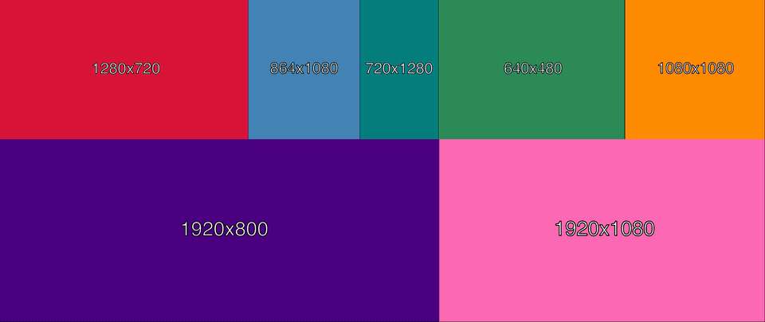
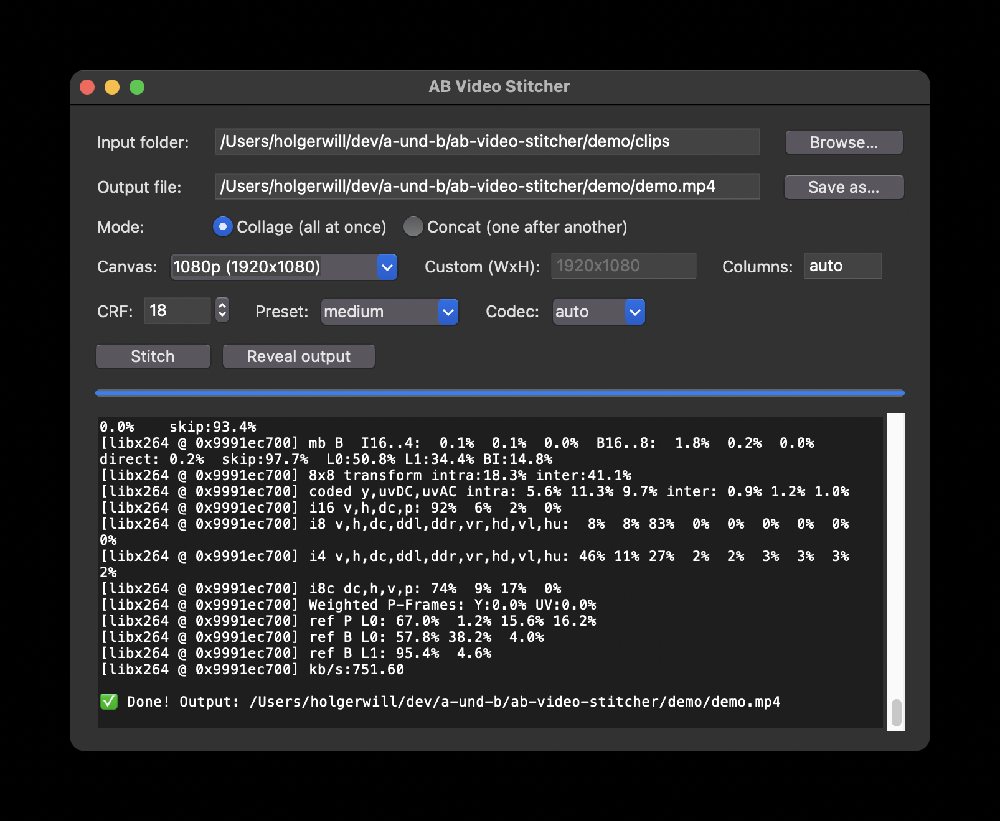

# AB Video Stitcher

Combine multiple video clips into a single video — either as a **packed collage
grid** where every clip plays at once, or as a **linear concatenation** where
clips play one after another.

Dependency-free (Python standard library only) — the only requirement is
`ffmpeg`/`ffprobe` on your `PATH`. Ships with both a command-line tool and a
small tkinter GUI.



*Seven synthetic clips of differing aspect ratios, packed into the 5k collage
canvas — labelled with their source resolution. Reproducible from [`demo/`](demo/),
no licensed footage.*

## Modes

- **collage** (default) — all clips play **simultaneously** in a grid that is
  packed to fill as many pixels as possible while respecting each clip's native
  aspect ratio (black bars fill any leftover space). Shorter clips loop until
  the longest one finishes. The canvas is set with `--canvas` — either a named
  preset or an explicit `WxH`:
  - presets: `720p`, `1080p`, `1440p`, `4k` (3840×2160), `5k` (5120×2160
    ultrawide, **default**), `square` (1080×1080), `vertical` (1080×1920)
  - custom: any even `WxH`, e.g. `--canvas 1920x1080`
- **concat** — clips play **one after another** (linear). Each clip is scaled
  and padded to the resolution of the largest clip in the batch so they join
  seamlessly.

Both modes output **without audio** and run as a **single ffmpeg process** (no
intermediate files).

## Requirements

- **Python 3.8+**
- **ffmpeg / ffprobe** on your `PATH` (both are invoked via `subprocess`)

```bash
# macOS
brew install ffmpeg

# Debian / Ubuntu
sudo apt install ffmpeg
```

No third-party Python packages are needed — `tkinter` ships with Python.

## Usage

### CLI

```bash
python video_stitcher.py /path/to/folder                  # collage, auto layout → stitched_5k.mp4
python video_stitcher.py /path/to/folder -o out.mp4       # custom output
python video_stitcher.py /path/to/folder --cols 3         # force 3 columns (collage only)
python video_stitcher.py /path/to/folder --canvas 1080p   # named preset (default: 5k)
python video_stitcher.py /path/to/folder --canvas 1920x1080  # custom WxH
python video_stitcher.py /path/to/folder --mode concat    # join clips end to end
python video_stitcher.py /path/to/folder --codec hevc     # force H.265 (default: auto)
python video_stitcher.py /path/to/folder --crf 18 --preset slow
python video_stitcher.py /path/to/folder -f              # overwrite an existing output
```

Input files are discovered (case-insensitively) by extension: `.mp4`, `.mov`,
`.avi`, `.mkv`. Clips are ordered alphabetically by filename. Unreadable files
are skipped with a warning rather than aborting the run.

### GUI

```bash
python video_stitcher_gui.py
```



Pick an input folder, choose collage or concat, tweak a few options, and hit
**Stitch**. The **Canvas** dropdown offers the same presets as the CLI; pick
**custom** to type an explicit `WxH` in the adjacent field. Encoding runs in a
background thread and ffmpeg's output streams into a log pane, so the window
stays responsive. Canvas and Columns are collage-only and are disabled in
concat mode. If the output file already exists, the GUI asks before
overwriting it.

## How the collage layout works

The layout algorithm tries **every column count from 1..n**, lays the clips into
rows greedily, and picks the column count that **maximises total filled pixels**.
Each row is given a "natural height" derived from the combined aspect ratios of
its clips, then all rows are scaled to fill the canvas height. Within a row, each
clip's cell width is proportional to its aspect ratio, and the clip is fit inside
its cell preserving aspect ratio. Pass `--cols` to bypass the search and force a
specific column count.

## Codec selection (and the macOS "plays then freezes" gotcha)

macOS VideoToolbox hardware-decodes H.264 only up to ~Level 5.2 (36864
macroblocks). The default 5k canvas (5120×2160 = 43200 macroblocks) exceeds
this, so x264 tags the output Level 6.0 and on a Mac it plays for a second and
then freezes while the clock keeps moving.

`--codec auto` (the default) handles this automatically: it keeps H.264 for
frames within the limit and switches oversized frames (such as the 5k canvas) to
**HEVC**, which macOS decodes fine. You can force a codec with `--codec h264` or
`--codec hevc`. HEVC output is tagged `hvc1` so QuickTime/Finder will play it.

The choice is by frame size, not preset name: everything at or under the 36864
macroblock limit (all presets up to `4k`, plus `square`, `vertical`, and most
custom sizes) defaults to H.264; anything larger (`5k`, or a big custom canvas)
defaults to HEVC.

## Notes

- There is no automated test suite. To verify a change, run the tool against a
  folder of differing-size/duration clips and inspect the output video and the
  printed layout table.
- The default output filename follows the canvas: `stitched_5k.mp4` (collage,
  default canvas), `stitched_1080p.mp4` for a preset, or `stitched_1920x1080.mp4`
  for a custom size; concat writes `stitched.mp4`. Pass `-o` to choose your own.
- **Overwrite protection:** an existing output aborts the CLI unless you pass
  `-f`/`--force` (the GUI asks instead). Writing the output on top of one of its
  own input clips is always refused — ffmpeg can't read and write the same file.

## License

[MIT](LICENSE) © 2026 anders & besser, Holger Will
